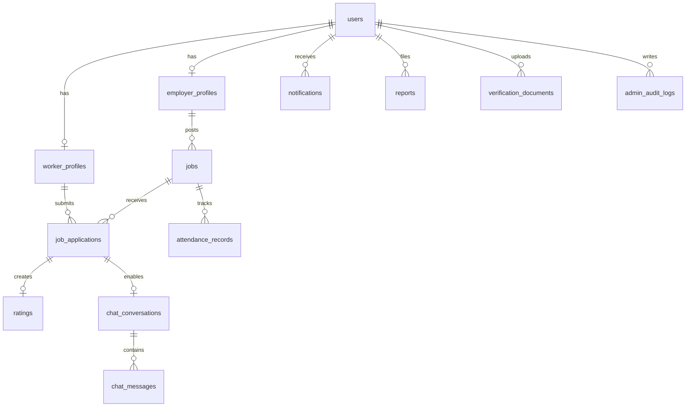

# Architecture

## V1 MVP Architecture

WorkShift starts as a modular monolith: one Spring Boot backend, one PostgreSQL database, one Next.js frontend, and Cloudinary for uploaded media.

### Backend Modules

- `auth`: registration, login, JWT creation, password hashing, refresh-token-ready contracts.
- `users`: worker, employer, and admin identities.
- `profiles`: worker and employer profile details.
- `jobs`: job posting, editing, listing, filtering, status transitions.
- `applications`: applications, accept/reject, completion, earnings history.
- `ratings`: post-job rating records.
- `admin`: moderation, employer verification, fake job removal, category management.
- `core`: shared exceptions, API response envelope, security filters, audit utilities.

### Frontend Modules

- Public shell: home, job discovery, login, registration.
- Worker dashboard: active jobs, applications, saved jobs, earnings, notifications.
- Employer dashboard: job postings, applicants, hired workers, attendance, completion stats.
- Admin dashboard: metrics, users, jobs, verification queues, disputes, settings.

### Deployment

- Vercel hosts the Next.js frontend.
- Railway or Render hosts the Spring Boot backend.
- Neon hosts PostgreSQL.
- Cloudinary stores photos and verification documents.

## V2 Upgrades

V2 keeps the modular monolith and adds operational workflows:

- Private employer-worker chat after accepted applications.
- Notifications with in-app records, email hooks, and future push readiness.
- Worker and employer verification document workflows.
- Saved jobs and advanced filters.
- Reports, disputes, and moderation queues.
- Attendance history and employer attendance closure.
- Multi-admin permissions.
- Settings for categories, banners, announcements, and application configuration.

## V3 Enterprise Readiness

V3 evolves the same codebase toward service-oriented boundaries without prematurely splitting deployments.

### Domain Boundaries

- `auth`
- `jobs`
- `applications`
- `chat`
- `notifications`
- `payments`
- `wallets`
- `analytics`
- `companies`
- `attendance`
- `moderation`
- `cms`
- `trust`

### Platform Additions

- Redis caching, rate limiting, Pub/Sub, and queue readiness.
- API versioning under `/api/v1`.
- Background workers for notifications, emails, analytics aggregation, report processing, and cleanup.
- Payment abstraction layer for Razorpay, Stripe, and UPI.
- QR attendance with short-lived signed tokens.
- Company hierarchy for owners, HR managers, recruiters, and branch admins.
- Region and city-aware access control for local moderation teams.

## ER Diagram

## Scaling Strategy

- Add indexes before adding infrastructure.
- Use cursor pagination for chat and offset pagination for admin tables in V1/V2.
- Cache read-heavy public data such as categories, settings, and popular cities in Redis.
- Move expensive analytics into scheduled aggregation tables before considering a separate warehouse.
- Keep WebSocket sessions stateless with Redis Pub/Sub when running more than one backend instance.
- Use API versioning before mobile apps ship.
